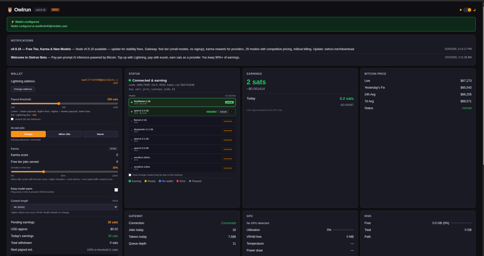
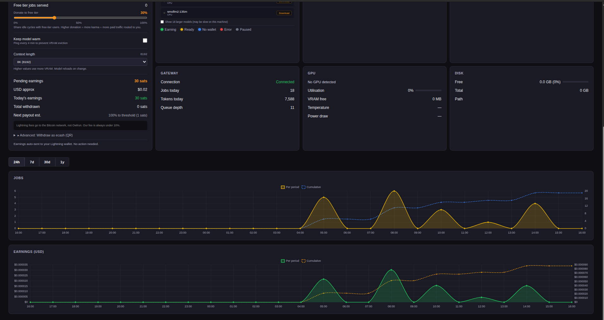

# Owlrun

Earn Bitcoin from your idle GPU by serving AI inference.

Owlrun runs silently in your system tray. When your machine is idle, it serves AI inference jobs and earns you sats. When you come back, it pauses automatically. Payouts go straight to your Lightning wallet — no accounts, no invoices, no waiting.

## Quick start

**Windows** (PowerShell):
```powershell
irm https://get.owlrun.me/install.ps1 | iex
```

**Linux / macOS** (bash):
```bash
curl -fsSL https://get.owlrun.me/install.sh | bash
```

That's it. The installer detects your GPU, installs [Ollama](https://ollama.com) if needed, downloads the binary, and starts earning. Open [localhost:19131](http://localhost:19131) to see your dashboard.

Full documentation, API reference, and integration guides: [docs.owlrun.me](https://docs.owlrun.me)

## How it works

1. **Install** — one command, zero config. A provider key is generated automatically.
2. **Idle** — Owlrun watches for keyboard/mouse inactivity and GPU usage. After 10 minutes idle, it starts accepting jobs.
3. **Earn** — the [Owlrun Gateway](https://owlrun.me) routes AI inference requests to your node. Your local Ollama runs the model and streams the response back.
4. **Get paid** — you earn 91% of every job. Sats are auto-paid to your Lightning address every 60 seconds. You can also withdraw as ecash (Cashu tokens) for zero-fee payouts.
5. **Pause** — move your mouse or launch a game, and Owlrun pauses instantly. Your GPU is always yours first.

```
Your machine                         Owlrun Gateway                      Buyer
+-----------+   WebSocket control   +----------------+    HTTPS API    +-------+
|  Owlrun   |--------------------->|   node.        |<---------------|  App  |
|  + Ollama |<------ jobs ---------|   owlrun.me    |--- response -->|       |
+-----------+   HTTP/2 proxy        +----------------+               +-------+
```

## Supported hardware

If it runs [Ollama](https://ollama.com), it runs Owlrun. Any NVIDIA (CUDA), AMD (ROCm), or Apple Silicon GPU works. Even CPU-only machines can earn on small models.

| GPU | VRAM | Typical models |
|-----|------|---------------|
| RTX 4090 / 3090 | 24 GB | llama3.1:70b-q4, deepseek-r1:70b, qwen2.5:32b |
| RTX 4080 / 3080 | 10-16 GB | llama3.1:8b, qwen2.5:14b, mistral:7b |
| RTX 4060 / 3060 | 8-12 GB | qwen2.5:7b, llama3.2:3b, phi3:3.8b |
| Apple M1/M2/M3/M4 | 8-192 GB unified | Depends on unified memory — up to 70b on high-end configs |
| CPU only | N/A | qwen2.5:0.5b, tinyllama:1b, smollm2:135m |

Model selection is automatic by default (`model_auto = true`) — Owlrun picks the best model your hardware can handle. More VRAM = bigger models = higher earnings.

### Model pricing

Provider earnings per million output tokens (you keep 91%+ of these rates):

| Tier | Models | Input $/M | Output $/M |
|------|--------|-----------|------------|
| Nano | smollm2:135m, qwen2.5:0.5b | $0.005 | $0.01 |
| Micro | qwen2.5:1.5b, llama3.2:3b | $0.010-0.015 | $0.02-0.03 |
| Small | qwen3:8b, qwen3.5:9b, deepseek-r1:8b | $0.030 | $0.08-0.10 |
| Medium | phi4:14b, mistral-small:24b | $0.050-0.080 | $0.12-0.20 |
| Large | qwen3:32b, deepseek-v3 | $0.080-0.120 | $0.20-0.30 |
| XL | llama3.1:70b, llama3.3:70b | $0.180 | $0.50 |

Live pricing: [`GET api.owlrun.me/v1/models`](https://api.owlrun.me/v1/models). Rates are 20-30% below centralized providers. This is a dynamic market — pricing is subject to change as supply and demand evolve.

## Payments

Owlrun pays in Bitcoin. No fiat, no stablecoins, no tokens.

### Lightning address (recommended)

Set your Lightning address once and forget it:

```ini
[account]
lightning_address = you@walletofsatoshi.com
```

Or set it from the dashboard at [localhost:19131](http://localhost:19131). Sats are auto-paid to your address every 60 seconds once your balance exceeds your threshold (default: 500 sats). You control the threshold from the dashboard slider.

Any Lightning-compatible wallet works: [Wallet of Satoshi](https://www.walletofsatoshi.com/), [Phoenix](https://phoenix.acinq.co/), [Alby](https://getalby.com/), [Zeus](https://zeusln.com/), etc.

### Ecash withdrawal (advanced)

For zero-fee withdrawals, claim your earnings as [Cashu](https://cashu.space/) ecash tokens from the dashboard. Scan the QR code with [Minibits](https://www.minibits.cash/) or any Cashu wallet. No Lightning routing fees.

### Revenue split

You keep 91% of every job. The gateway takes a single-digit routing margin.

| Tier | Monthly tokens | You keep |
|------|---------------|----------|
| Starter | < 1M | 91% |
| Pro | 1M - 10M | 93% |
| Elite | 10M - 100M | 95% |
| Ultra | 100M+ | 96% |

**Affiliate program**: share your referral code (`owlr_ref_...`) and earn 20% of the gateway's cut on every node you refer, for 12 months. The referred node's payout is never reduced.

## Requirements

- **OS**: Windows 10+, macOS 12+, or Linux (x86_64 / arm64)
- **Disk**: 8 GB+ free (for AI model storage)
- **Network**: outbound HTTPS + WSS to `node.owlrun.me`
- **GPU**: NVIDIA, AMD, Apple Silicon, or CPU-only (lower earnings)

## Dashboard

Open [localhost:19131](http://localhost:19131) once Owlrun is running.





The dashboard shows:

- **Earnings** — sats earned today and all-time, with charts
- **GPU stats** — utilization, VRAM, temperature, power draw
- **Models** — installed models with pricing, install/remove controls
- **Wallet** — Lightning address setup, payout threshold slider, ecash claim
- **Gateway** — connection status, queue depth, job history
- **Settings** — job mode (idle/always/never), context length, keep-warm toggle

## Configuration

Config file: `~/.owlrun/owlrun.conf` (auto-generated on first run)

```ini
[account]
api_key           = owlr_prov_...      # Auto-generated — no signup needed
lightning_address = user@minibits.cash  # Lightning address for BTC payouts
referral_code     =                    # Optional affiliate code (owlr_ref_...)

[marketplace]
gateway        = https://node.owlrun.me
region         = auto              # Auto-detected from IP, or set manually

[inference]
model_auto     = true              # Auto-select best model for your VRAM
max_vram_pct   = 80                # Max % of VRAM to use for inference

[idle]
trigger_minutes = 10               # Start earning after N minutes idle
gpu_threshold   = 15               # Only earn if GPU usage < N%
watch_processes = true             # Pause when games are running

[disk]
warn_threshold_pct = 30
min_model_space_gb = 8
```

See [`owlrun.conf.example`](owlrun.conf.example) for all options.

## CLI flags

```
owlrun --version    Show version and network (beta/production)
owlrun --mock       Start in mock mode (no Ollama required — useful for development)
```

## Troubleshooting

**Dashboard shows "Disconnected"**
- Check your internet connection
- Verify `gateway` in config points to `https://node.owlrun.me`
- Check `~/.owlrun/owlrun.log` for connection errors

**"No models installed"**
- Owlrun needs at least one Ollama model. Install one manually: `ollama pull smollm2:135m`
- Or set `model_auto = true` and Owlrun will suggest models for your VRAM

**Ollama won't start**
- If Ollama is already running (e.g. from another terminal), Owlrun will detect and use it
- On Linux, check: `systemctl --user status ollama` or `pgrep ollama`

**Earnings show $0.00**
- Set your Lightning address in the dashboard or config file
- Make sure your node is in "earning" state (tray icon turns green)
- Small models earn less — larger VRAM = bigger models = higher earnings

**Windows installer crashes**
- Use PowerShell 5.1+ (pre-installed on Windows 10/11)
- If `irm | iex` fails, download the script manually and run it

## Build from source

Requires Go 1.25+.

```bash
# Native build
make build

# All platforms (Windows, Linux amd64/arm64, macOS amd64/arm64)
make build-all

# Run tests
make test

# Lint
make vet
```

Cross-compile for a specific platform:

```bash
GOOS=windows GOARCH=amd64 CGO_ENABLED=0 go build -o dist/owlrun.exe ./cmd/owlrun
GOOS=darwin  GOARCH=arm64 CGO_ENABLED=0 go build -o dist/owlrun-darwin-arm64 ./cmd/owlrun
```

## Project structure

```
owlrun/
  cmd/owlrun/           Entry point
  internal/
    config/             INI config loader
    tray/               System tray (Windows, Linux D-Bus, macOS)
    idle/               Idle detection + game process scanner
    gpu/                GPU detection and live monitoring
    disk/               Disk space checks
    inference/          Ollama lifecycle manager (find, install, start, pull, stop)
    earnings/           SQLite earnings tracker
    marketplace/        Gateway connector (WebSocket + HTTP/2 proxy)
    wallet/             Cashu ecash wallet + Lightning address management
    dashboard/          Local web dashboard on localhost:19131
    assets/             Embedded icon files (green/yellow/blue/red/grey owl)
    buildinfo/          Version + network injection via ldflags
    geo/                Region detection
    cashu/              Cashu token parsing
  installer/
    install.ps1         Windows installer (Task Scheduler auto-start)
    install.sh          Linux/macOS installer (systemd/launchd auto-start)
  .github/workflows/
    build.yml           CI: vet, test, govulncheck, 5-platform build, CDN deploy
```

## Uninstall

**Linux (systemd)**:
```bash
systemctl --user stop owlrun
systemctl --user disable owlrun
rm -f ~/.config/systemd/user/owlrun.service
systemctl --user daemon-reload
rm -f ~/.local/bin/owlrun
rm -rf ~/.owlrun/
```

**Linux (XDG autostart)**:
```bash
rm -f ~/.config/autostart/owlrun.desktop
rm -f ~/.local/bin/owlrun
rm -rf ~/.owlrun/
```

**macOS**:
```bash
launchctl unload ~/Library/LaunchAgents/me.owlrun.agent.plist
rm -f ~/Library/LaunchAgents/me.owlrun.agent.plist
rm -f ~/.local/bin/owlrun
rm -rf ~/.owlrun/
```

**Windows** (PowerShell):
```powershell
Unregister-ScheduledTask -TaskName "Owlrun" -Confirm:$false
Remove-Item "$env:LOCALAPPDATA\Owlrun" -Recurse -Force
Remove-Item "$env:USERPROFILE\.owlrun" -Recurse -Force
```

## Contributing

See [CONTRIBUTING.md](CONTRIBUTING.md).

## License

[MIT](LICENSE)
